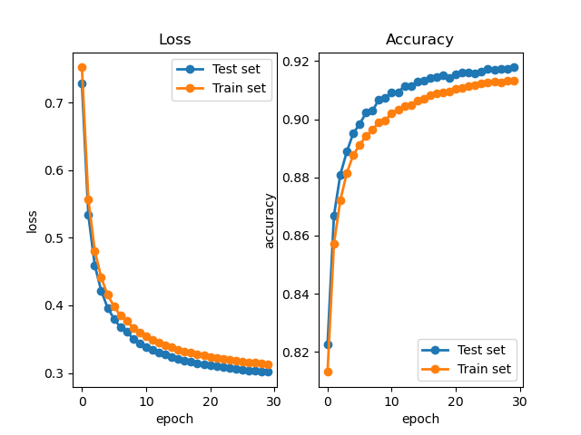

# Computer-Vision-Course
Homeworks of CV courses 

## Homework 1
The Dataset **MNIST** is downloaded from [http://yann.lecun.com/exdb/mnist/](http://yann.lecun.com/exdb/mnist/).

####  Clone the codes 
```shell
git clone https://github.com/OriginSound/Computer-Vision-Course.git 
cd Computer-Vision-Course/homework1
```

#### Train
```python 
python train.py
```

#### Test 
```python
python test.py 
```

#### Results
**<center>Loss: 0.3017**,   **Accuracy: 91.78%.</center>**

#### Loss & Accuracy

<div align=center></div> 

#### Visualization of Parameters

<div align=center></div>